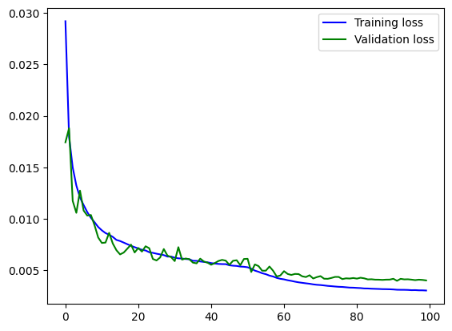
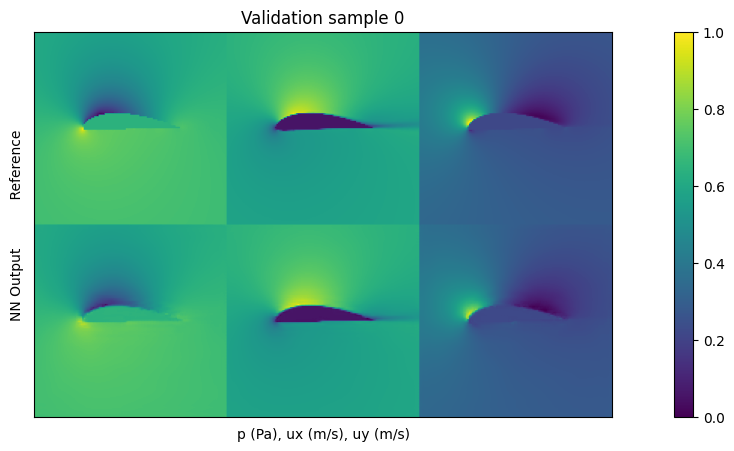
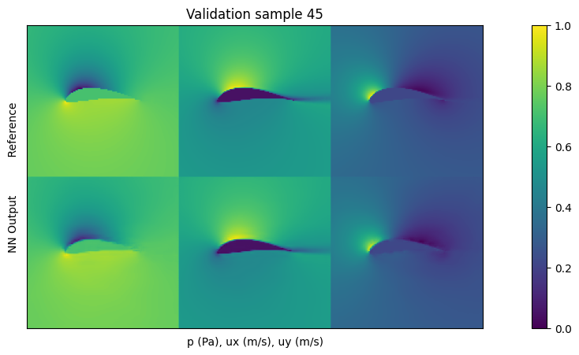
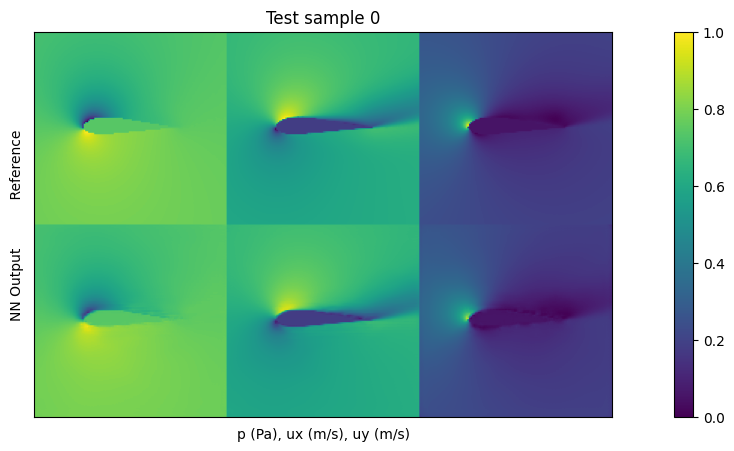
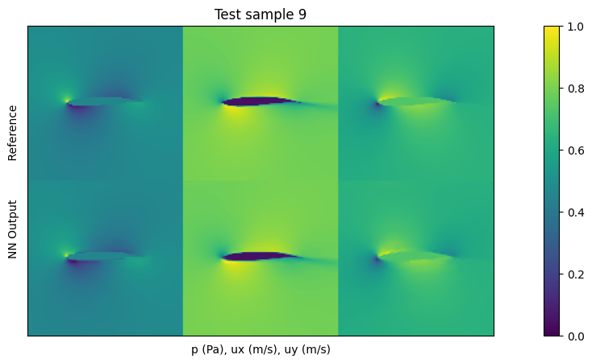

# FlowSynth: Synthesizing Fluid Dynamics with Machine Learning

## Table of Contents

- [Overview](#overview)
- [Features](#features)
- [Technical Details](#technical-details)
- [Project Structure](#project-structure)
- [Prerequisites](#prerequisites)
- [Dataset](#dataset)
- [Getting Started](#getting-started)
- [Training](#training)
- [Results](#results)
- [Future Scope of this Project](#Future-Scope-of-this-Project)

## Overview

FlowSynth is a machine learning project that focuses on synthesizing fluid dynamics using deep learning techniques. The project aims to predict and generate fluid flow behaviors using a U-Net based architecture, allowing researchers and enthusiasts to simulate complex fluid dynamics scenarios efficiently.

## Features

- Generation of fluid flow behaviors using a U-Net architecture.
- Training pipeline to learn fluid dynamics patterns from input data.
- Evaluation and testing of the trained model on validation and test datasets.
- Visualization tools to showcase generated fluid flow compared to ground truth.

## Technical Details

- Neural Network Architecture: U-Net
- Loss Function: L1 Loss
- Optimizer: Adam
- Training Data: Preprocessed fluid dynamics simulation data
- Input Shape: 128x128x3
- Output Shape: 128x128x3
- Hyperparameters: Learning Rate, Batch Size, Epochs

## Project Structure

- `code/`: Contains the Python scripts implementing the neural network architecture, training, and testing procedures.
- `data/`: Placeholder for your training, validation, and test datasets (not provided here).
- `results/`: Directory to store the generated results and visualizations.
- `utils.py`: Helper functions for image output, data handling, and more.

## Prerequisites

- Python 3.x
- PyTorch
- NumPy
- Matplotlib
- PIL (Python Imaging Library)

## Dataset

Below you can download a large-scale training data set, and the test data set:

* Reduced data set with 6.4k samples plus test data (1.2GB): [Reduced Data Set (1.2GB)](https://dataserv.ub.tum.de/s/m1470791/download?path=%2F&files=data_6k.tar.gz)
* Full data set with 53.8k samples plus test data (10GB): [Full Data Set (10GB)](https://dataserv.ub.tum.de/s/m1459172/download?path=%2F&files=data_full.tar.gz)

## Getting Started

1. Clone this repository: `git clone https://github.com/YajurAgarwal/FlowSynth.git`
2. Navigate to the project directory: `cd flowsynth`
3. Install required dependencies: `pip install -r requirements.txt`
4. Prepare your training, validation, and test datasets and place them in the appropriate `data/` subdirectories.
5. Modify hyperparameters, network architecture, and training settings in the code as needed.

## Training

To train the model:

1. Run: `python train.py`

## Validation

To validate the model on validation data:

1. Run: `python validate.py`

## Testing

To test the model on unseen data:

1. Run: `python test.py`

## Results

#### Training Loss V/S Validation Loss

#### Validation Sample

#### Validation Sample

#### Test Sample

#### Test Sample

## Future Scope of this Project 

There are several avenues for further exploration in this project, such as experimenting with hyperparameters, utilizing better and larger datasets, and employing more complex network architectures.

#### Experimenting with Hyperparameters
- Explore variations in hyperparameters, including learning rate, dropout rate, kernel size, and the number of filters, to optimize model performance.

#### Utilizing Better and Larger Datasets
- Although I've employed a dataset containing 6400 training samples, there is potential to generate a larger dataset using the OpenFOAM code I've provided. This expansion in data can contribute to training a more versatile and accurate model.

#### Employing More Complex Network Architectures
- While I've implemented a simple U-Net architecture, there's room for experimentation with more intricate models like ResNet and VGG. These architectures can serve as potent feature extractors, enabling the model to capture finer details and nuances in the data.

By pursuing these directions, the project can potentially achieve enhanced results and offer a deeper understanding of the relationship between the chosen variables.
